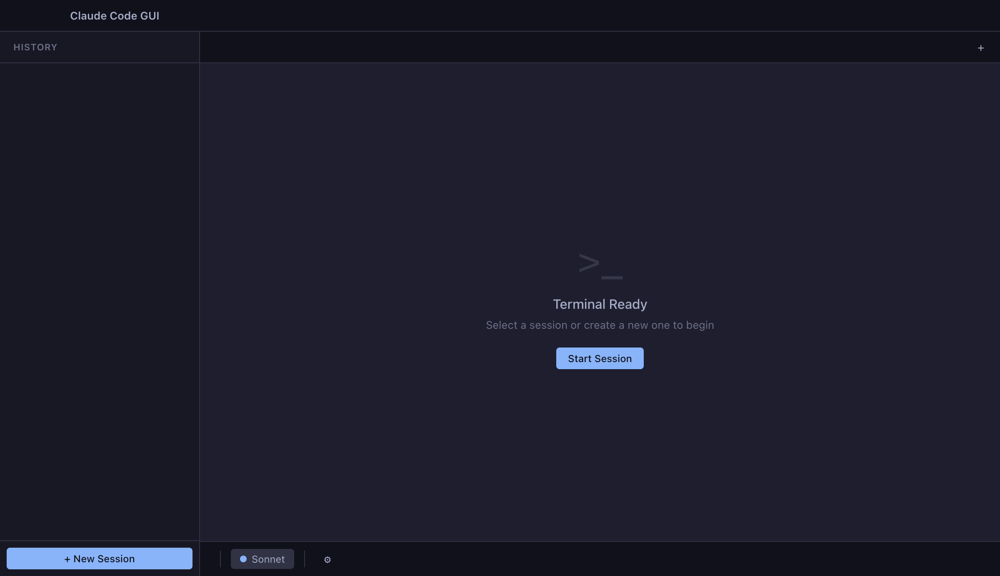
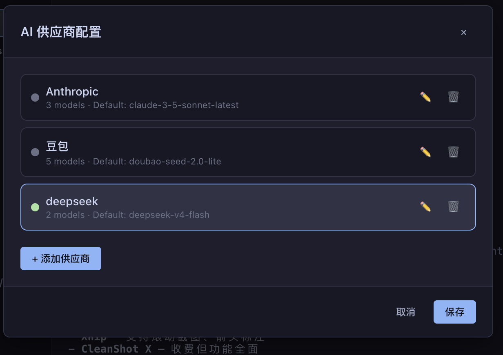

> ⚠️ **注意：Claude Code 的 `/model` 命令会修改 `~/.claude/settings.json` 文件，导致工具栏显示的当前模型可能与实际不一致。工具栏模型选择器仅用于发送 `/model` 切换命令，不保证显示状态与 Claude Code 内部状态同步。**

# Claude Code GUI

一个 macOS 原生风格的 Claude Code 桌面客户端，为 Claude Code CLI 提供图形化多会话管理界面。



## ✅ 已实现功能

### 多会话管理
- 基于 **node-pty** 启动独立的 Claude Code 进程，每个会话拥有独立 PTY
- 顶部标签栏快速切换会话（固定宽度 150px），支持关闭单个会话
- 左侧侧边栏展示**活跃会话**和**历史会话**两个分区
- 自动发现 `~/.claude/projects/` 下的历史会话，按项目分组、按时间倒序展示
- 历史会话支持 AI 标题显示，无标题时回退显示第一条用户消息（截断 60 字符）
- 点击历史会话可快速在对应工作目录新建会话并恢复上下文
- 支持 "New Session" / "New Tab" 两种方式创建会话

### 终端交互
- 基于 **xterm.js** 的全功能终端渲染，支持 256 色和 ANSI 转义序列
- 手动适配窗口大小（无需第三方 addon），窗口 resize 自动更新 PTY 尺寸
- 完整支持交互式输入（光标、退格、方向键等）
- 会话切换时保留终端回滚历史

### 多供应商配置
- 支持配置多个 AI 供应商（Anthropic、豆包、Gemini、千问等）
- 每个供应商可独立设置 API Key、Base URL、默认模型、自定义模型列表
- 配置保存在 `~/.claude/claude-code-gui/settings.json`
- PTY 启动时自动注入当前供应商的 `ANTHROPIC_AUTH_TOKEN` 和 `ANTHROPIC_BASE_URL`
- 同步更新 Claude Code 原生 `~/.claude/settings.json` 的环境变量配置

### 工具栏模型选择器
- 工具栏显示当前模型（带彩色状态点：Opus/Sonnet/Haiku）
- 下拉菜单展示当前供应商的所有模型列表
- 选择模型后自动向当前会话发送 `/model {name}` 命令并自动回车确认
- 切换标签页时自动同步工具栏显示为对应会话的模型

### 历史会话增强
- 从 `.jsonl` 文件解析会话元数据（模型、git 分支、消息数等）
- 恢复历史会话时在终端打印消息历史
- 无确认直接删除历史会话
- 项目目录可点击选中、高亮显示，点击目录自动展开并关闭其他目录
- 新会话默认使用选中的项目目录

### macOS 原生体验
- 隐藏标题栏 + 原生拖动区域
- 毛玻璃侧边栏效果 (`vibrancy: sidebar`)
- Catppuccin macOS 深色主题
- SF Mono 优先等宽字体渲染终端

## 📋 待实现功能

- [ ] 命令面板 (`Cmd+Shift+P`)
- [ ] 浅色主题跟随系统切换

## 安装与运行

### 前置要求
- Node 22 LTS（通过 nvm 自动切换）
- 已安装 Claude Code CLI (`npm install -g @anthropic-ai/claude-code`)

### 步骤

```bash
# 切换到 Node 22
nvm use

# 安装依赖
npm install

# 重编译 node-pty 适配 Electron（只需要做一次）
npx @electron/rebuild

# 启动应用（正式模式，不打开DevTools）
npm start

# 开发模式（打开DevTools并启用远程调试）
npm run dev
```

## 项目结构

```
claude-code-gui/
├── index.html              # 主页面（加载 CSS + xterm.js + renderer JS）
├── preload.js              # Electron preload 脚本（contextBridge 暴露 API）
├── package.json
├── .nvmrc                  # nvm Node 版本指定
├── .node-version
├── src/
│   ├── main/
│   │   ├── index.js        # Electron 主进程入口，IPC handlers 注册
│   │   ├── pty.js          # node-pty 会话管理 (spawn/kill/write/resize)
│   │   └── provider-config.js  # 供应商配置读写、环境变量管理
│   ├── renderer/
│   │   ├── app.js          # 渲染进程逻辑，xterm.js 集成，UI 交互
│   │   ├── model-selector.js   # 工具栏模型选择器下拉菜单
│   │   └── provider-model.js   # 供应商配置模态框 UI
│   └── shared/
│       └── channels.js     # IPC 通道常量定义
```

## 技术栈

| 层级 | 技术 |
|------|------|
| 框架 | Electron 28 |
| 终端 | xterm.js 6 |
| 伪终端 | node-pty 1 |
| 语言 | 纯 JavaScript（无构建工具，最小化依赖） |
| UI | 原生 HTML/CSS + 手动 DOM 操作 |

## 设计原则

- **最小化依赖**：只保留核心依赖，避免引入大型框架
- **原生优先**：使用 Electron 原生 macOS 特性，体验一致
- **纯 JS 开发**：无需编译，直接运行，易于修改

## 数据流

```
Renderer (用户输入) → contextBridge → ipcRenderer → ipcMain → node-pty → Claude Code CLI
Claude Code CLI → node-pty (onData) → ipcMain (send) → ipcRenderer (on) → xterm.js (write)
```

## 调试

开发模式 (`npm run dev`) 启动时自动打开 DevTools，并监听 `9333` 端口供远程调试：

```bash
npm run dev
# DevTools 访问：http://127.0.0.1:9333
# 选择 "Claude Code GUI" 打开检查器
```

正式模式 (`npm start`) 不开启调试功能和 DevTools。

## 许可证

MIT
